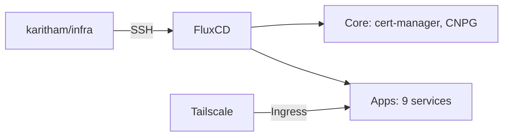

# infra

Kubernetes infrastructure-as-code for a single cluster (**riko**), managed with FluxCD via GitOps.

## Architecture



Flux polls GitHub every minute, reconciles Kustomizations every 10 minutes. All web services are exposed via Tailscale ingress on `*.dolly-ruffe.ts.net`.

## Directory Structure

```
apps/              # Reusable app manifests (source of truth)
clusters/riko/     # Cluster-specific wiring
  core/            # Infrastructure (cert-manager, cnpg)
  apps/            # Flux Kustomizations pointing at apps/
  flux-system/     # Flux bootstrap
```

Each app in `apps/` is referenced by a Flux Kustomization in `clusters/riko/apps/`. This separation lets the same app definitions be reused across clusters.

## Deployed Services

| Service                                                             | Description                | Access                       |
| ------------------------------------------------------------------- | -------------------------- | ---------------------------- |
| [Outline](https://github.com/outline/outline)                       | Wiki/knowledge base        | `outline.dolly-ruffe.ts.net` |
| [Memos](https://github.com/usememos/memos)                          | Note-taking (auto-updates) | `memo.dolly-ruffe.ts.net`    |
| [Pocket ID](https://github.com/pocket-id/pocket-id)                 | OIDC provider              | `id.dolly-ruffe.ts.net`      |
| [Radar](https://github.com/skyhook-io/radar)                        | K8s observability          | `k8s.dolly-ruffe.ts.net`     |
| [Minecraft](https://github.com/itzg/docker-minecraft-server)        | Java server                | NodePort 30565               |
| [Minecraft Geyser](https://github.com/itzg/docker-minecraft-server) | Java + Bedrock server      | —                            |
| [Alloy](https://github.com/grafana/alloy)                           | Observability collector    | —                            |
| [Tailscale Operator](https://github.com/tailscale/tailscale)        | Networking                 | —                            |
| [Waifubot](https://github.com/Karitham/waifubot)                    | Discord bot                | —                            |

## Key Patterns

### Adding an app

1. Create `apps/myapp/` with manifests + `kustomization.yaml`
2. Create `clusters/riko/apps/myapp.yaml` (Flux Kustomization pointing at `./apps/myapp`)
3. Add `myapp.yaml` to `clusters/riko/apps/kustomization.yaml`
4. Push — Flux reconciles within ~1 minute

### Secrets

Encrypted with [SOPS](https://github.com/getsops/sops) + [age](https://age-encryption.org/). Rules in `.sops.yaml`:

```bash
sops --encrypt --in-place secret.yaml   # encrypt
sops secret.yaml                         # edit (decrypts in $EDITOR)
```

Flux decrypts using the `sops-age` Secret in `flux-system`.

### Variable substitution

`${TSNET}` → `dolly-ruffe.ts.net` — injected via postBuild in `clusters/riko/kustomization.yaml`. Used in Ingress hosts and app URLs.

### Ingress

All web apps use `ingressClassName: tailscale` with host `<name>.${TSNET}`. Tailscale operator handles TLS automatically.

## Core Infrastructure

- [cert-manager](https://github.com/cert-manager/cert-manager) (v1.15.2) — Let's Encrypt certs, Cloudflare DNS01 for `0xf.fr`
- [CNPG](https://github.com/cloudnative-pg/cloudnative-pg) (v1.26.0) — PostgreSQL operator, used by Outline and Waifubot

## CI

- [Gitleaks](https://github.com/gitleaks/gitleaks) runs on every push/PR via GitHub Actions and as a pre-commit hook
